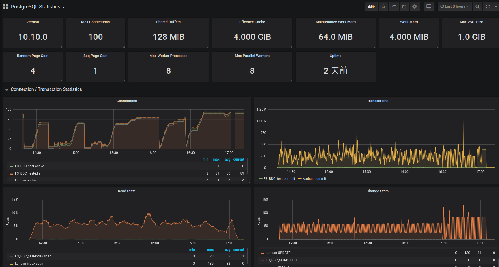

[TOC]

# 运维监控平台

## 运维是什么

运维是最后端最容易被忽视的工作，却又是软件生命周期中最基本的一环。保障线上服务稳定运行，为所有线上问题负责到底，这就是运维的职责，但又远远不止于此。

传统意义上的运维是并不出彩的工作，不出彩的原因很大一部分是因为运维工作者是站在“维”的角度被动、响应式地思考和行动。但其实要做好应用运维还需要更多地从服务架构，软件开发，持续交付等环节考虑不断改进。

运维监控平台的最大价值就是将潜在问题及早暴露出来，促进开发与运维的良性循环。

## 运维监控平台

先来看看使用运维平台的各项功能，在解决实际问题过程的作用。下图是一个问题解决的路线图:

- 问题发生是个必然，但如果每次都是被动的响应客户提出的问题，那显然会造成比较高的用户流失，所以首要的一点就是潜在问题发生之后能推送预警信息。
- 基于预警信息，排查相关服务的运维状态。如果可以直观的看到各相关服务的运行状态，则有助于我们快速定位出问题的环节，不至于挨个程序的排查。
- 初步定位到异常服务之后，可以分析服务日志来定位具体的异常原因。此时考虑到服务往往部署多点，传统查看日志的方式往往会很低效，如果有一个平台可以快速集中地查看指定时段的特征信息相信会方便很多。

上面提到的是如何利用运维平台帮助我们发现问题解决问题，其实它还有很多附加价值:

- 基于统一日志平台，降低日志清洗以及日志分析的复杂度，有助于建立企业级数仓做数字化转型。
- 基于量化的资源使用情况，方便后期合理分配服务可使用的资源，做到资源利用率最大化。
- 基于监控到的性能数据，研发团队可以对服务有一个更全面的了解，整体提升研发团队的业务能力。

## 解决的核心诉求

### 服务监控

传统的服务监控仅是监控了服务是否正常启动，但往往启动不等于健康。所以针对常见的基础服务，我们提供服务运行状态监控，通过完善的服务指标信息全方位探测服务的健康状态，并且我们也提供了可视化的**Dashoard**。

当前已支持的服务如下:

- MySQL
- PostgreSQL
- MongoDB
- Redis
- Elasticsearch
- Kafka
- Ceph
- Java
- Golang
- Nginx
- Zookeeper
- Flink
- 服务器，VM

### 告警及预警

常规的告警方式是触发一次告警请求就推送一次通知，但此简单粗暴的方式仅适用于业务早期起步阶段，随着业务复杂度不断提升，异常可能在某个时间点集中爆发，精力有限的运维同学可能会被很多重复异常而忽略掉一些重要的问题。

所以基于常规的告警模式，我们做了如下改进:

- 告警分组

    通过分组合并，能帮助运维降低告警数量，同时能有效聚合告警信息。因为很多指标是相关联的，如果能在一个消息里面能查看到一组异常指标信息，定位问题也更加快速。

- 告警抑制

    同一个服务指标可能定义不同的等级，比如服务宕了1min，5min，4h是不同的概念，当报宕机4h的时候，宕机1min这样的告警提示显然就没有意义了，所以告警信息的输出要有优先级。
    
- 告警静默

    在做数据库定时备份的时候，系统指标肯定会出现异常，而针对此类可预期的情况，可以设置静默策略，避免不必要的信息推送。

- 告警延迟

    延时处理机制可以缓解告警轰炸问题，不过延迟时间要合理，否则会影响告警的及时性

- 告警策略

    自定义告警策略，可以是微信，钉钉，也可以是邮件，也可以针对特定的告警诉求去做服务重启之类的。

### 日志统一收集

平台除了提供对服务状态的监控之外，还提供日志查看的工具，方便在统一的平台上查看问题时段的业务日志。

## 应用场景

### Greenplum数仓监控

#### 背景描述

某企业为了落地智能工厂，试图构建私有的数仓，来满足后期各类业务和数据分析的需求。

数仓的硬件构成:

- 服务器: `5`台`64C512G`
- 存储盘: `20`SATA, `10`SSD
- 带宽  : `10G`

数据默认存储在SATA上，但针对Tempspace(数据库事务日志，临时表的存放位置)以及DW层(整理后的数据)放在了SSD上，以提高数仓整体的相应速度。

但即便是如此高规格的物理配置，成本保守估计都得12w，在正常运行一段时间之后，业务人员在做数据清洗以及提取的时候会不时地出现卡顿的情况，那问题的根源在哪?

#### 影响范围

如果再任由这种情况持续下去，势必会造成:

- 随着数仓数据量的逐步增加，SQL执行时间会成指数性增长
- 如此高的IOPS，会让SSD的寿命缩短，无形中增加了投入成本。工业级的SSD一般能用4~5年，最后可能用不了2年就报废了，数据丢失的风险也明显增加。
- 工作效率问题，增加人力成本

#### 问题定位

当你还猜不出问题原因的时候，先可以瞅瞅系统的各项性能指标，看看系统指标有何异常，再之后由浅入深逐步定位一下问题所在。

比如上面就是问题时段各服务器节点的性能监控看板，从系统资源的使用上我们可以看出:

- CPU/Mem: 虽然耗用也不少，但距上限还有点很大差距
- Network I/O: 虽然已经达到500M+，但10G的网络上限在1G左右，即便是容器化之后，因为一些性能损耗，整体也能维持在800M，所以还不算排满了
- Disk I/O: 不管是SSD还是HDD，使用率几乎顶满了，初步判断问题的根源还是磁盘读写太多。尤其是SSD都顶满了，这得多高的读写。

核心问题是磁盘IO已经达到了瓶颈。

#### 解决方案

基于上述问题，就得考虑优化一下磁盘IO，以下是一些可行的办法:

- SQL子查询优化以及分布键使用优化
- AO压缩表
- 消除表膨胀(VACCUM FULL、表重建)
- 即时执行Analyse，以便查询优化器能够生成更高效的执行计划
- 批处理操作优化
- 删除GPCC需要检索的历史监控数据
- 临时表优化

最后仅仅是采用`VACCUM FULL`重建了几张大表，就让IO有了明显的下降，具体下降的服务可以参看上图中IO监控曲线。

这样通过量化的指标数据，也方便做优化后的验证工作。

### Postgres数据库监控

#### 背景描述

数据存储服务除了偏OLAP方向的Greenplum，最常见的还是OLTP型的数据库。

某企业为了落地流实时处理，采用Postgres作为实时数仓，以应对短期数据频繁的增删改查操作。而对接PG的服务有很多:

- Kettle Job
- Flink Task
- Python Servive
- Java Servive

但如此多的业务服务共享同一数据源，难免会造成资源的争抢，除了操作系统层面上的资源之外，还有服务本身可用的资源，比如，可连接数，共享内存池。如果某个业务开发人员因为经验问题写出了一些资源占用较高的代码，则肯定会对其他业务造成影响，具体影响的范围可大大小。

举个例子，某一天，业务人员反馈说无法通过`pgAdmin`访问`Postgres`数据库了，提示`too many connections`，显然是数据库连接数用量达到了上限。 

#### 影响范围

- 所有在线服务阻塞，无法正常工作
- 用户无法通过DBMS软件查看数据

#### 问题定位

上图是问题时段PG数据库的监控看板，从连接视图来看，问题时段Flink Task建立的连接数增加明显，这为我们缩小问题范围奠定了基础。

通过Flink自身提供的Dasboard来查看一下服务的状态，发现近期Flink Task出现了频繁重启的异常，而重启之后之前使用的数据库连接资源并未释放掉。

#### 解决方案

针对上述问题，分析了一下代码，最后发现是代码写的很粗放，连接资源没有做释放操作。这种编码问题放在程序正常执行的时候体现不出来，但是如果程序异常重启多次，那该问题就很明显了，并且作为定时炸弹可能直接造成很多业务瘫痪。

最后做了hotfix之后，该问题得到了修正，其他业务也恢复正常。

### Redis缓存服务监控

#### 背景描述

某公司对外提供微信商城服务，用户可通过该平台购买进口水果。

但最近商城首页加载越来越卡顿，极大地影响了用户的使用体验。

#### 影响范围

- 首页加载越来越慢，长达5s+，不良的用户体验无形中增大了客户流失率
- 后端服务接口响应时间增加，并发量降低，无法承担双节期间的促销活动
- 用户怀疑商家的可靠性，还能不能靠谱点

#### 问题定位

首页加载涉及的问题很多，主要可从以下几个方面考虑:

- 静态资源发布是否用了CDN?
- 服务接口响应是否有延迟?
- 页面渲染的方式是否合理?
- 手机设备网络问题?
- 跨机房访问延迟问题?

从上述几方面入手分析，可以把问题的范围定位在**服务接口响应慢**上。

而后台接口服务的实现需要依赖几项:

- Java服务(业务逻辑实现)
- Redis服务(订单/用户等缓存信息的读写)
- MySQL服务(订单/用户等信息的读写)

考虑到业务代码需要细致的分析，所以先从其他两项入手，反推出来服务使用是否有问题。此处，以Redis为例简要说明一下。

以下是Redis服务的监控看板:

从中可以看出如下问题:

- 键值一直在递增，且Key都没有设置过期时间，显然是把Redis作为持久化存储来用了，而该用法会有潜在的数据丢失风险。
- 存在大量时间复杂度为`O(N)`的操作，比如: `keys`，随着存储数据的不断增加，单线程的Redis只会越来越不堪重负。
- QPS波动明显，从几百直接飙升至10k+，怀疑业务代码编写有问题，循环对Redis进行读写。

上述问题也印证首页加载不断变慢的根源所在。

#### 解决方案

针对发现的问题，通过调优业务程序，采用`Hash`/`ZSet`数据结构存储相关信息来避免大范围的检索，最终将首屏加载的速度缩短至`2s`内。

## 服务监控指标

### Mongo

- 连接数(当前/可用) -- 判断客户端连接池使用是否合理
- QPS -- 查看读写比，判断是什么类型应用，以及通过判断是否有周期性的特征
- 内存占用 -- 如果超过几十G，表引擎选择是否合理
- Page Faults -- 是否存在全表扫描
- 扫描文档数/返回文档数 -- 查看是否存在全Collection的扫描，或者索引是否合理
- 锁 -- 查看是否存在锁表的情况
- 运行时间 -- 判断是否存在异常重启，以及服务稳定性

相关参考:

- [Check your query and index performance with the Query Targeting Chart](https://www.mongodb.com/blog/post/check-your-query-and-index-performance-with-the)
- [Maximize MongoDB Performance by Minimizing Page Faults](https://dzone.com/articles/mongodb-page-faults-metric)

### Postgres

- 常见系统配置(buffer/并行度/连接数) -- 判断配置是否要进行优化
- 连接数 -- 与系统配置的上限做比较，判断客户端连接是否合理、
- QPS -- 查看服务使用情况，读写比，Cache命中率
- Temp File -- 查看是否存在临时文件生成
- 锁 -- 查看是否存在互相等待的情况
- 辅助进程 -- 查看buffer中数据落盘以及磁盘数据加载到情况，确认IO问题

相关参考:

- [PostgreSQL bgwriter,walwriter,backend process 写磁盘的实时监控](https://github.com/digoal/blog/blob/master/201811/20181125_01.md)
- [PostgreSQL 实时健康监控 大屏 - 高频指标 - 珍藏级](https://github.com/digoal/blog/blob/master/201806/20180613_02.md)

### Influxdb

- Measures -- 代表指标数，一般接入的服务越多，该值也越大。
- Series -- 如果某个DB下该指标很高的话，可能就需要考虑业务使用是否合理
- Shards -- 数据库某个RP(保留策略)下分片数，如果分片的间隔时间不合理的话，可能造成大量的分片，超过默认系统最大可打开的文件数，同时可能造成CPU上下文的频繁切换。
- 内存使用 -- 粗略判断一下使用的索引数据加载采用inmem方式，是否需要调整库引擎

相关参考:

- [InfluxDB概念和基本操作](https://www.cnblogs.com/wzbk/p/10569683.html)
- [使用连续查询及保留策略优化InfluxDB存储空间及内存占用](https://blog.bingozai.com/2019/08/05/optimize-influxdb/)
- [InfluxDB频繁OOM问题排查](https://www.jianshu.com/p/dbbb73b537e1)

### JVM

适用于Kafka等Java系服务

- Heap内存使用率　-- 超过百分之多少，超过80%就得考虑调大对内存大小
- 新生代老生代的GC情况 -- 看看每次GC能释放多少空间，如果几乎没怎么减少，则必须得优化内存了
- GC Time -- 查看GC时间是否稳定维持在百毫秒级别

### Greenplum

- 服务器CPU/Mem/Disk
- 表膨胀查询
- Spilt Files(溢出文件情况)
- Segment节点存活状态

### Kafka

- Lag是否增长
