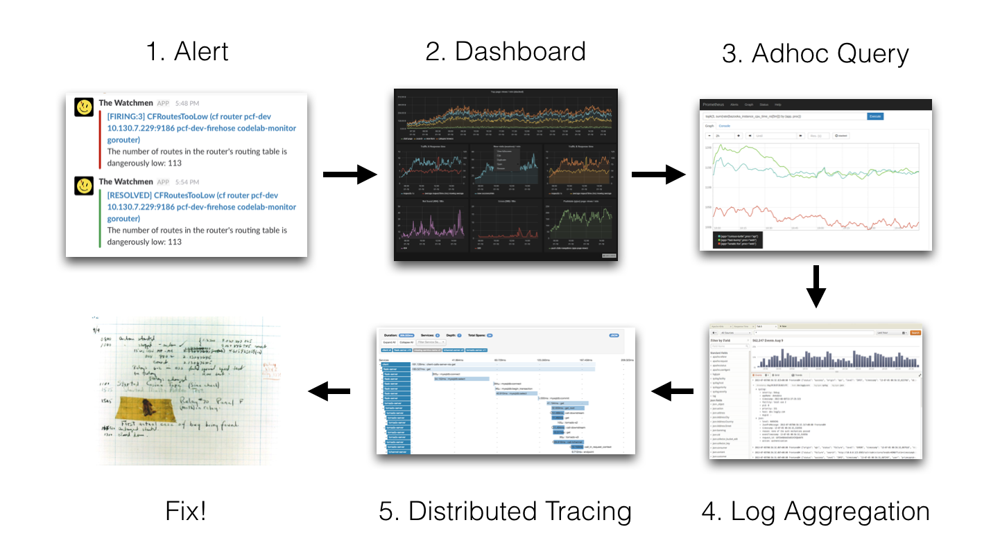
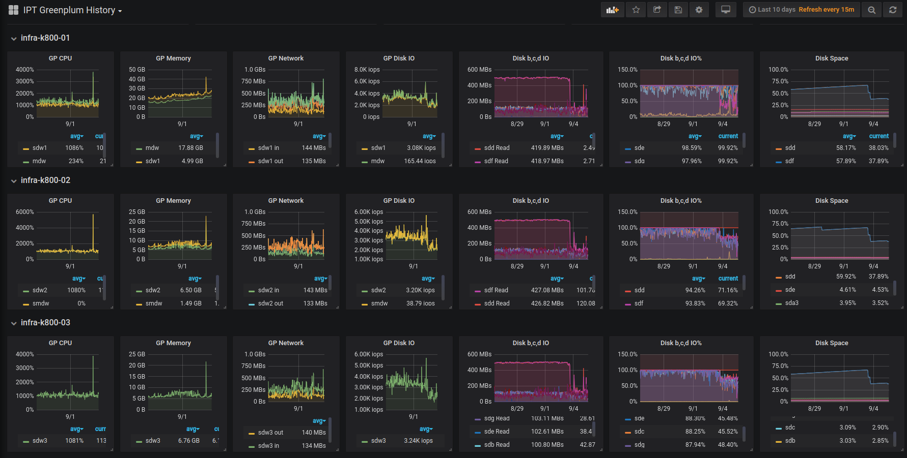
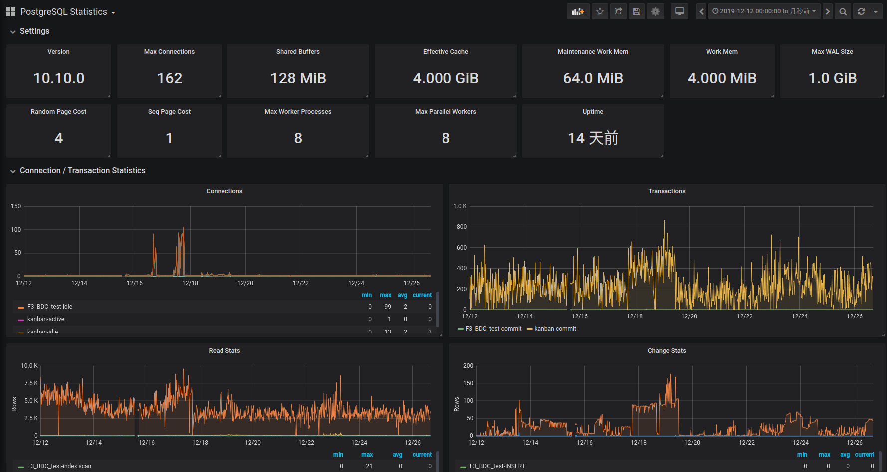
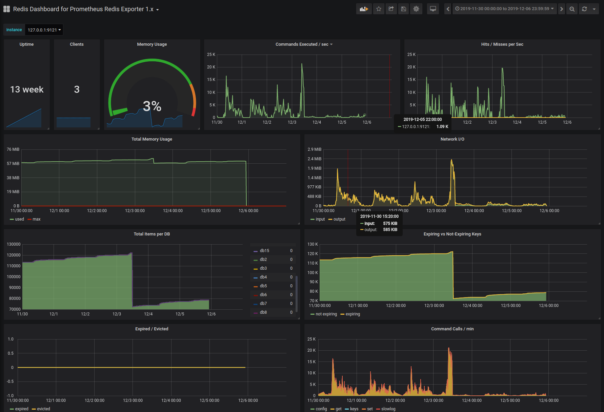

# 目录
[TOC]

## 运维是什么

运维是最后段最容易被忽视的工作，却又是软件生命周期中最基本的一环。保障线上服务稳定运行，为所有线上问题负责到底，这就是运维的职责，但又远远不止于此。

传统意义上的运维是并不出彩的工作，不出彩的原因很大一部分是因为运维工作者是站在“维”的角度被动、响应式地思考和行动。但其实要做好应用运维还需要更多地从服务架构，软件开发，持续交付等环节考虑不断改进。

运维监控平台的最大价值就是将潜在问题及早暴露出来，促进开发与运维的良性循环。

## 运维监控平台

先来看看使用运维平台的各项功能，在解决实际问题过程的作用。下图是一个问题解决的路线图:

- 问题发生是个必然，但如果每次都是被动的响应客户提出的问题，那显然会造成比较高的用户流式，所以首要的一点就是潜在问题发生之后能推送预警信息。
- 基于预警信息，排查相关服务的运维状态。如果可以直观的看到各相关服务的运行状态，则有助于我们快速定位出问题的环节，不至于挨个程序的排查。
- 初步定位到异常服务之后，可以分析服务日志来定位具体的异常原因。此时考虑到服务往往部署多点，传统查看日志的方式往往会很低效，如果有一个平台可以快速集中地查看指定时段的特征信息相信会方便很多。

上面提到的是如何利用运维平台帮助我们发现问题解决问题，其实它还有很多附加价值:

- 基于统一日志平台，降低日志清洗以及日志分析的复杂度，有助于建立企业级数仓做数字化转型。
- 基于量化的资源使用情况，方便后期合理分配服务可使用的资源，做到资源利用率最大化。
- 基于监控到的性能数据，研发团队可以对服务有一个更全面的了解，整体提升研发团队的业务能力。

## 解决的核心诉求

### 服务监控

传统的服务监控仅是监控了服务是否正常启动，但往往启动不等于健康。所以针对常见的基础服务，我们提供服务运行状态监控，通过完善的服务指标信息全方位探测服务的健康状态，并且我们也提供了可视化的**Dashoard**。

当前已支持的服务如下:

- MySQL
- PostgreSQL
- MongoDB
- Redis
- Elasticsearch
- Kafka
- Ceph
- Java
- Golang
- Nginx
- Zookeeper
- 服务器，VM

### 告警及预警

常规的告警方式是触发一次告警请求就推送一次通知，但此简单粗暴的方式仅适用于业务早期起步阶段，随着业务复杂度不断提升，异常可能在某个时间点集中爆发，精力有限的运维同学可能会被很多重复异常而忽略掉一些重要的问题。

所以基于常规的告警模式，我们做了如下改进:

- 告警分组

    通过分组合并，能帮助运维降低告警数量，同时能有效聚合告警信息。因为很多指标是相关联的，如果能在一个消息里面能查看到一组异常指标信息，定位问题也更加快速。

- 告警抑制

    同一个服务指标可能定义不同的等级，比如服务宕了1min，5min，4h是不同的概念，当报宕机4h的时候，宕机1min这样的告警提示显然就没有意义了，所以告警信息的输出要有优先级。
    
- 告警静默

    在做数据库定时备份的时候，系统指标肯定会出现异常，而针对此类可预期的情况，可以设置静默策略，避免不必要的信息推送。

- 告警延迟

    延时处理机制可以缓解告警轰炸问题，不过延迟时间要合理，否则会影响告警的及时性

- 告警策略

    自定义告警策略，可以是微信，钉钉，也可以是邮件，也可以针对特定的告警诉求去做服务重启之类的。

### 日志统一收集

平台除了提供对服务状态的监控之外，还提供日志查看的工具，方便在统一的平台上查看问题时段的业务日志。

## 效果展现

### Greenplum数仓监控

上图是数仓服务的监控看板，直观地反映出系统资源的占用情况。

从系统资源的使用上我们可以看出，CPU/内存虽然占用也不少，但核心问题是磁盘IO已经达到了瓶颈。

依赖量化的指标数据，可以采用合适的策略去优化以及验证，最后可以看出磁盘IO明显降到了正常范围。

### Postgres数据库监控

上图是PG数据库的监控看板，直观地反映出服务的配置以及实时运行状态。

从运行状态来看，服务的连接数短时间内变化很明显，且已经接近服务配置的上限。从这个切入点入手，看看客户端是否有什么异常。

### Redis缓存服务监控

上图是Redis数据库的监控看板，直观地反映服务的使用方式。

从中可以看出Redis存储的键值一直在递增，没有任何过期的Key，且存在大量时间复杂度为O(N)的操作。
初步可以预测出服务性能会越来越低效。基于该论断分析业务代码实现，很容易就定位出处理不当的业务逻辑。